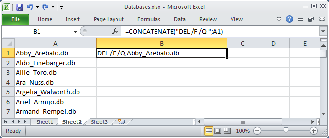
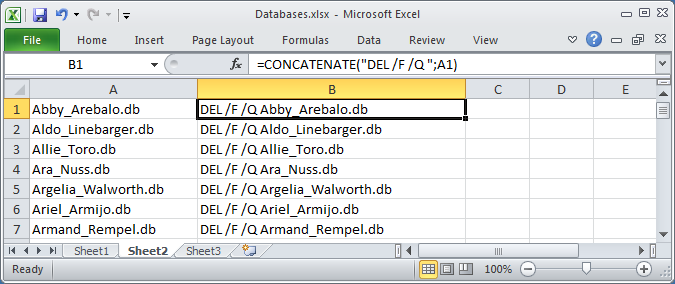
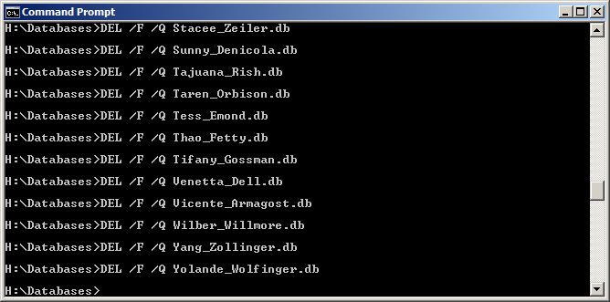

Microsoft Excel is a very powerful tool. It is being used every day by lots of people around the world and every one of them uses it in a slightly different manner. Many different tasks can be completed using Excel. I personally believe that Excel is the best Microsoft product.

In my everyday job, I use Excel for several tasks. Of course, there is reporting tasks when I am preparing performance graphs or finding thin places in huge amounts of data. Also, I use excel when fulfilling my system administrator's task. In this article, I want to share some useful tips that help me every day.

Imagine that you need to provide a list of user's databases to HR so they can clean it up. This is a pretty simple task. In Windows open command prompt, go do directory which contains databases and enter

```Shell Session
dir /b > databases.csv
```

"/b" option needs to eliminate unnecessary information in the resulting file. In Linux, it is even simpler. Just type in

```Shell Session
  ls > databases.csv
```

and that is it. This will populate the file with filenames in the directory. You can then open in Excel, do whatever you want and send it to the HR department.

Now imagine that your file was processed and you have 100 records selected for removal. Some of the people would remove it by hands and be Ok with it. I would like to automate this task a little. There is no need to install additional software for this. We will use only Excel and the command prompt. Filter your result the way you can see only files that need to be removed. Next to the column with filenames type in this formula:

```
CONCATENATE("DEL /F /Q"; A1)
```

This way you get command for quiet deletion of the file as a result. In Linux, I would use this command.

```bash
rm -f
```



Then expand column "B" and you will get the desired command for every file from the "A" column.



Looks great! All you need to do is to open a command prompt, navigate to the folder that contains these files and copy-paste column "B" to command prompt. Every command from the column will be performed one by one and all the required files will be removed.



This is a good way to save some time. You can automate many routine tasks this way. Instead of delete command, you can create files, rename them, copy. You can do the same trick with directories. All you need to do is to take your list and concatenate it with the right command that will perform a quiet operation.

Be careful with this as you may accidentally do something you would not want. It is good to create a test environment and try it out there.

P.S. BTW, for this article, I used [http://listofrandomnames.com](http://listofrandomnames.com) to create a list of random names. Then I created files the same way described in this article. This is a great solution for testing your batch commands. Good Luck!
