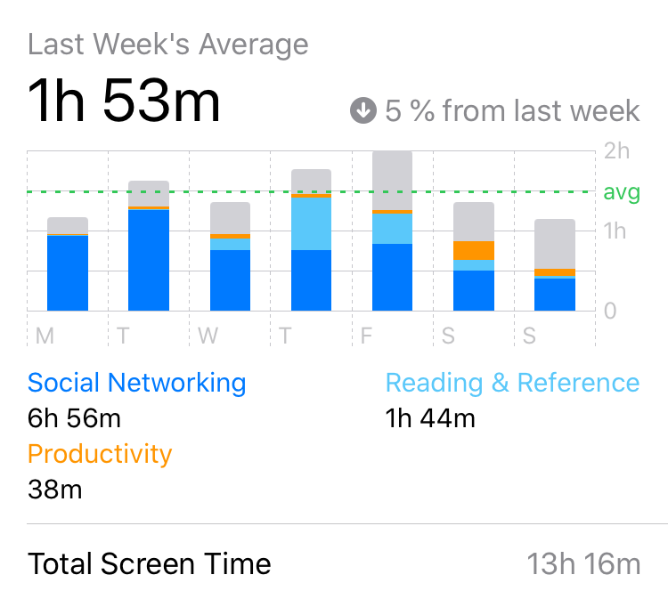
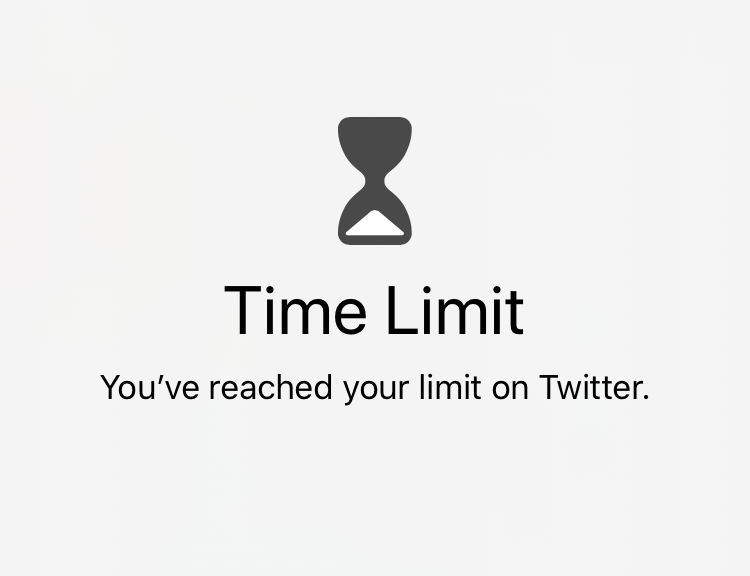

I always wanted to read more. Everybody wants to read more.

We all know it is very important for us to read actual books instead of web articles and facebook feed. But it always seems there is not enough time for books. Where should one find an hour or so to read a book if he struggles to find time even for a cup of tea?

I thought this way all of the time until Apple introduced screen time feature to iOs. Then I found I spend two hours a day in front of my phone, and that's even after I ditched Instagram from my phone and set a time limit for twitter.

My weekly social networking time is 7 hours. What am I doing there for 7 hours? That's a lot of time! I could redirect it to reading books. Of course, some of that time is spent on a toilet seat, but even there you could read a book rather than scrolling infinity facebook feed.

My advice for everybody who is struggling to read more books:

- Remove most of the social networking apps from your phone, so you don't have quick access to them.
- Set limits for the ones that you decided to keep.
- Every time you reach for a phone to grab, either resist the urge and get a book instead or start reading from an application.
- When your phone says it's enough, don't snooze the alarm, get a book.
- When it starts to work, make limits a little bit smaller.

Voila! You have several hours a week for books. We don't even realize how much time we spend on those social networks that specially designed this way, so we keep scrolling on and on.

Keeping your books on a separate device or even on paper makes it easier. If you are reading from your phone you could slip to opening messaging application or news feed.

We all love memes and kittens, but let's face it - they don't make us smarter. So let's keep that kitten-time limited and spend some of it for reading books. Then you can enjoy your kittens and be both intelligent and happy.
